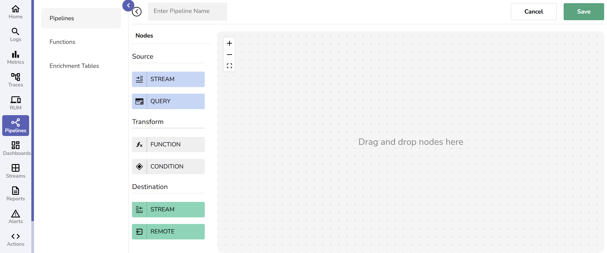
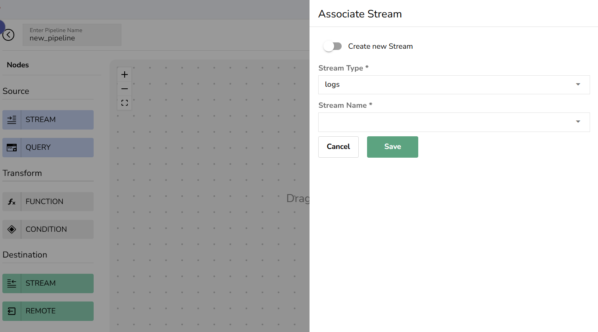
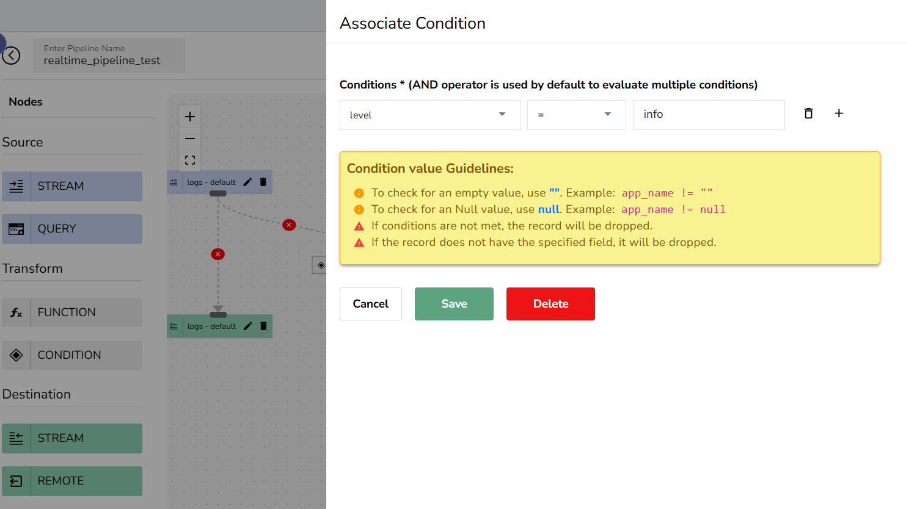
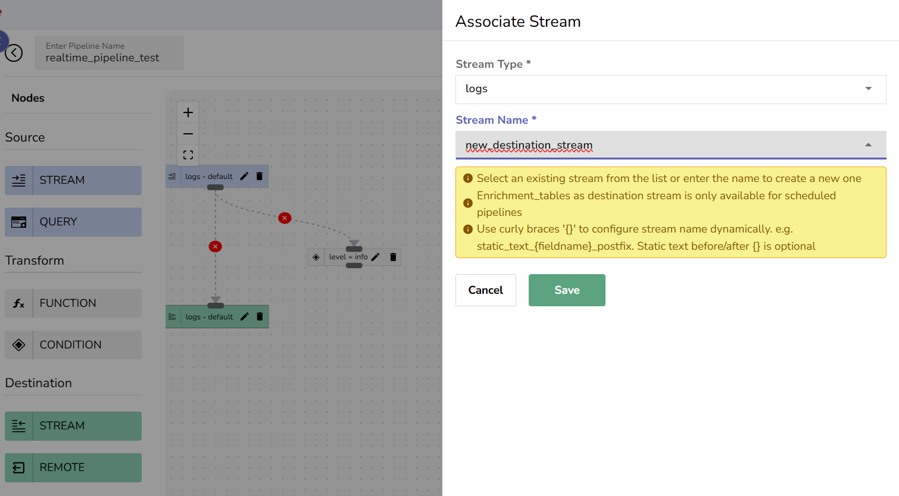
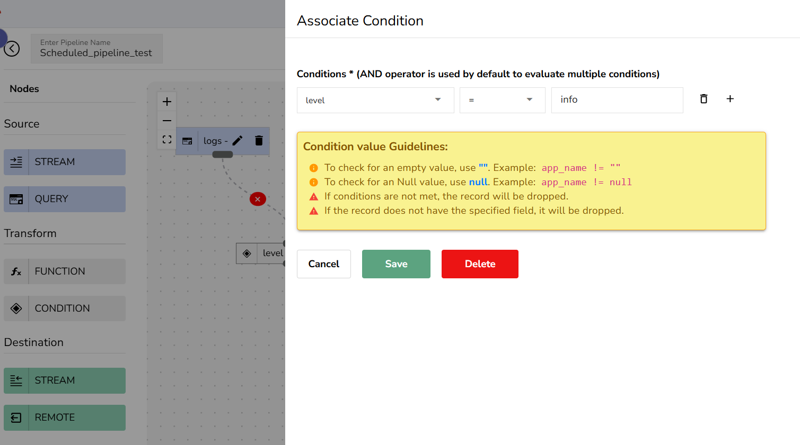
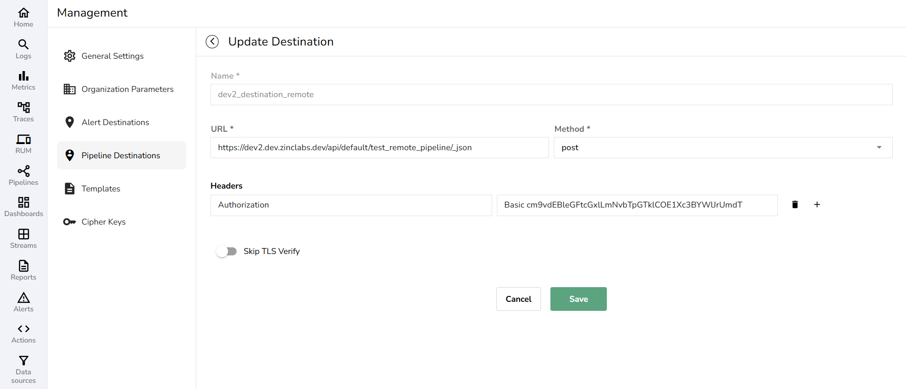

This page provides an overview of pipelines, their types, and how they work. 

## What are Pipelines?
Pipelines enable seamless data ingestion and transformation using an intuitive drag-and-drop interface.

## Types of Pipelines
OpenObserve supports two types of pipelines to cater to different data processing needs: 

- **Real-time pipelines** 
- **Scheduled pipelines**

### Real-Time Pipelines
A real-time Pipeline processes incoming raw data instantly, enabling immediate transformations and routing without delays.

#### How they work

1. **Source**: As soon as raw data is ingested into the source stream, the pipeline begins processing it.
    - The supported source stream types are Logs, Metrics, or Traces. **Note**: Each source stream can be associated with only one real-time pipeline. 
    
2. **Transform**: The pipeline applies conditions or functions to filter and transform the data in real-time. 

3. **Destination**: The transformed data is sent to the following destination(s) for further use or storage: 
    - **Stream**: The supported destination stream types are Logs, Metrics, Traces, or Enrichment tables.  **Note**: Enrichment Tables can only be used as destination streams in scheduled pipelines.
    
    - **Remote**: Select **Remote** if you wish to send data from the pipeline to [external destinations](#external-pipeline-destinations).

#### When to use
Use real-time pipelines when you need immediate processing, such as monitoring live data and cleaning logs in real-time.

### Scheduled Pipelines

A scheduled pipeline automates the processing of historical data from an existing stream at user-defined intervals. This is useful when you need to extract, transform, and load (ETL) data at regular intervals without manual intervention. 

#### How they work

1. **Source**: To create a scheduled pipeline, you need an existing stream, which serves as the source stream. 
    - The supported source stream types are Logs, Metrics, or Traces. 
2. **Query**: You write a SQL query to fetch historical data from the source stream. When defining the query, you also set the [**Frequency** and **Period**](#the-scheduled-pipeline-runs-based-on-the-user-defined-frequency-and-period) to control the scheduling. 

3. **Transform**: The fetched data is transformed by applying functions or conditions.

4. **Destination**: The transformed data is sent to the following destination(s) for storage or further processing: 
    - **Stream**: The supported destination stream types are Logs, Metrics, Traces, or Enrichment tables.  **Note**: Enrichment Tables can only be used as destination streams in scheduled pipelines.
    - **Remote**: Select **Remote** if you wish to send data to [external destination](#external-pipeline-destinations).

### The scheduled pipeline runs based on the user-defined **Frequency** and **Period**. 

- **Frequency**: Defines how often the query should be executed.   **Example**: **Frequency**: 5 minutes It ensures the query runs every 5 minutes.
- **Period**: Defines the period for which the query fetches the data.   
    **Note**: The period should be the same as frequency, and both must be greater than 4.   
    **Example**: **Period**: 5 minutes It ensures the query fetches the data that was ingested in the last 5 minutes. 
- **Frequency with Cron**: Cron allows you to define custom execution schedules based on specific expressions and timezones. It is ideal for scenarios requiring tasks to run at predefined times.  **Example**: **Cron Expression**: `0 0 1 * *`
 **Timezone**: Asia/Kolkata
 It ensures the query runs at 12:00 AM IST (00:00 in 24-hour format) on the first day of the month. 

#### When to use
Use scheduled pipelines for tasks that require processing at fixed intervals instead of continuously, such as generating periodic reports and processing historical data in batches.

## External Pipeline Destinations
OpenObserve allows you to route pipeline data to external destinations. 

To configure an external destination for pipelines: 

1. Navigate to the **Pipeline Destination** configuration page. You can access the configuration page while setting up the remote pipeline destination from the pipeline editor or directly from **Management** (Settings icon in the navigation menu) > **Pipeline Destinations** > **Add Destination**.
2. In the **Add Destination** form, provide a descriptive name for the external destination.
3. Under **URL**, specify the endpoint where the data should be sent.
4. Select the HTTP method based on your requirement.
5. Add headers for authentication. In the **Header** field, enter authentication-related details (e.g., Authorization). In the **Value** field, provide the corresponding authentication token.
6. Use the toggle **Skip TLS Verify** to enable or disable Transport Layer Security (TLS) verification.  
**Note**: Enable the **Skip TLS Verify** toggle to bypass security and certificate verification checks for the selected destination. Use with caution, as disabling verification may expose data to security risks. You may enable the toggle for development or testing environments but is not recommended for production unless absolutely necessary.

## Next Steps
- [Create and Use Pipelines](Create-and-Use-Pipelines.md)
- [Manage Pipelines](Manage-Pipelines.md)