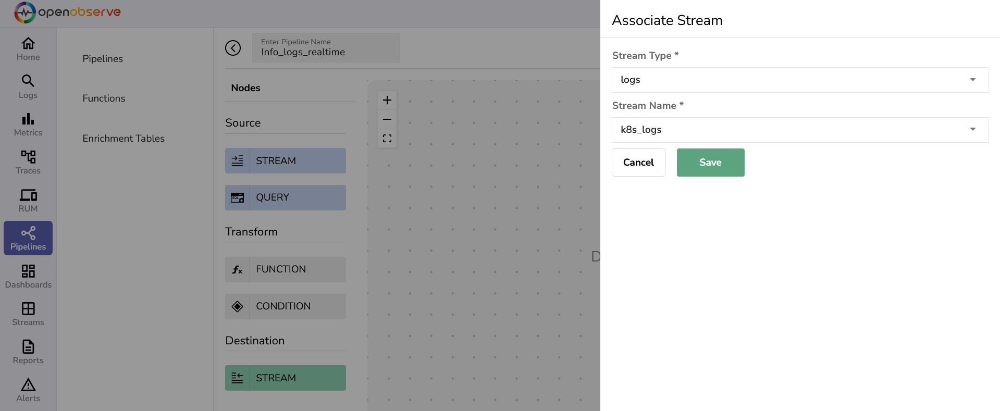

This page provides an overview of pipelines, their types, and how they work. 

## What are Pipelines?
Pipelines enable seamless data ingestion and transformation using an intuitive drag-and-drop interface.

## Types of Pipelines
OpenObserve supports two types of pipelines to cater to different data processing needs: 

- **Real-time pipelines** 
- **Scheduled pipelines**

### Real-Time Pipelines
Real-time pipeline processes incoming raw data instantly. 

#### How they work
As soon as the raw data gets ingested into the source stream, the pipeline applies conditions or functions to filter and transform the data in real-time. The transformed data is sent to the destination stream for further use or storage.  
> **Note**: Each source stream can be associated with only one real-time pipeline.

#### When to use
Use real-time pipelines when you need immediate processing, such as monitoring live data and cleaning logs in real-time.

### Scheduled Pipelines
<!-- I think this section needs some more work. -->
<!-- The main difference is that the source here is an existing stream's historical data  -->
<!-- The sql query does a log search request with time range defined by the Period on an existing stream, the search request results are then passed through Transformation and eventually Destination(s) -->
<!-- This flow is executed once every x mins, with x being defined by Frequency -->
<!-- Data is historical data and processing is mainly aggregating, the purpose is to pre-aggregate data to downstream analytics -->
<!-- I know scheduled pipeline can be confusing at first. Please lmk if this is not helpful and you'd like to discuss more -->
Scheduled pipeline processes historic data from an existing stream at user-defined intervals. 

#### How they work

Based on the time range defined by the **Period**, the SQL query performs a search request on the existing stream’s historic data. The search results are then passed through transformation and eventually sent to destination stream(s). This flow runs at regular intervals based on **Frequency**. 

- **Frequency**: Defines how often the query should be executed.   **Example**: **Frequency**: 5 minutes It ensures the query runs every 5 minutes.

- **Period**: Defines the period for which the query fetches the data.   
    > **Note**: The period should be the same as frequency, and both must be greater than 4.   
    
    **Example**: **Period**: 5 minutes It ensures the query fetches the data that was ingested in the last 5 minutes. 

- **Frequency with Cron**: Cron allows you to define custom execution schedules based on specific expressions and timezones. It is ideal for scenarios requiring tasks to run at predefined times.  **Example**: **Cron Expression**: `0 0 1 * *`
 **Timezone**: Asia/Kolkata
 It ensures the query runs at 12:00 AM IST (00:00 in 24-hour format) on the first day of the month. 

#### When to use
Use scheduled pipelines for tasks that require processing at fixed intervals instead of continuously, such as generating periodic reports and processing historical data in batches.

## Next Steps
- [Create and Use Pipelines](https://github.com/openobserve/openobserve-docs/blob/new-docs/docs/user-guide/Pipelines/Create-and-Use-Pipelines.md)
- [Manage Pipelines](https://github.com/openobserve/openobserve-docs/blob/new-docs/docs/user-guide/Pipelines/Manage-Pipelines.md)