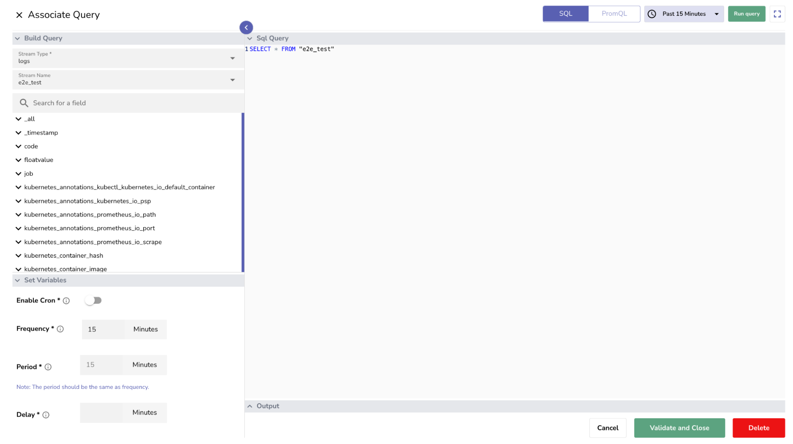

This guide explains how to use the configurable delay feature for [scheduled pipelines](Pipelines-in-OpenObserve.md).
This feature allows you to delay the execution of a scheduled pipeline by a set number of minutes after its scheduled start time. This is useful to ensure data completeness and accommodate late-arriving events before the pipeline runs.

## How to Configure Delay

When editing the **Associate Query** page:

1. In the **Set Variables** section, configure:  

    - **Frequency**: How often the pipeline should run.  
    - **Period**: The data window the pipeline should process.  
    - **Delay**: How many minutes to wait after the scheduled time before running the pipeline.

2. Select **Validate and Close**.

**Note**: Since Delay is a required field when setting up a scheduled pipeline, enter 0 minutes if you want the pipeline to run exactly at the scheduled time without any delay.

**Example**

If the pipeline is configured with the following settings:

- Frequency: 5 minutes  
- Period: 5 minutes  
- Delay: 2 minutes

**Behavior:** The pipeline is scheduled every 5 minutes and runs 2 minutes after each scheduled time, processing data from the previous 5-minute window.  
At 10:00 AM (scheduled time), the pipeline executes at 10:02 AM, processing data from 9:55 AM to 10:00 AM.

**Note**

- **Works with Cron**: Delay also applies when using cron-based schedules.  
- **Data Window Unchanged**: Delay only affects when execution starts. It does not change the data range.

**Related Links** 
For steps on creating scheduled pipelines, see [Scheduled Pipelines](Create-and-Use-Pipelines.md).  

