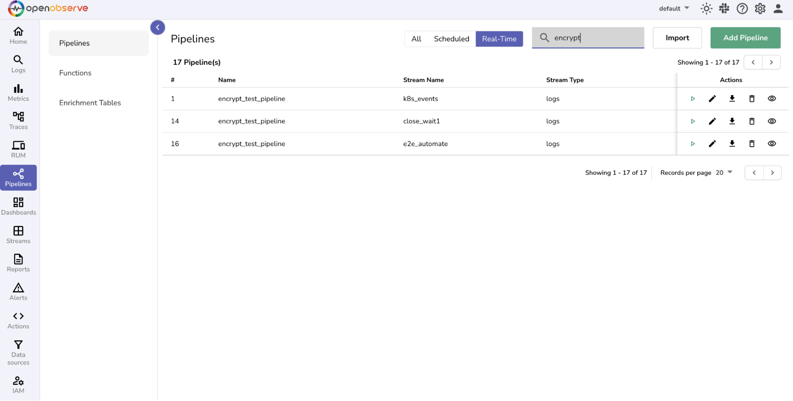
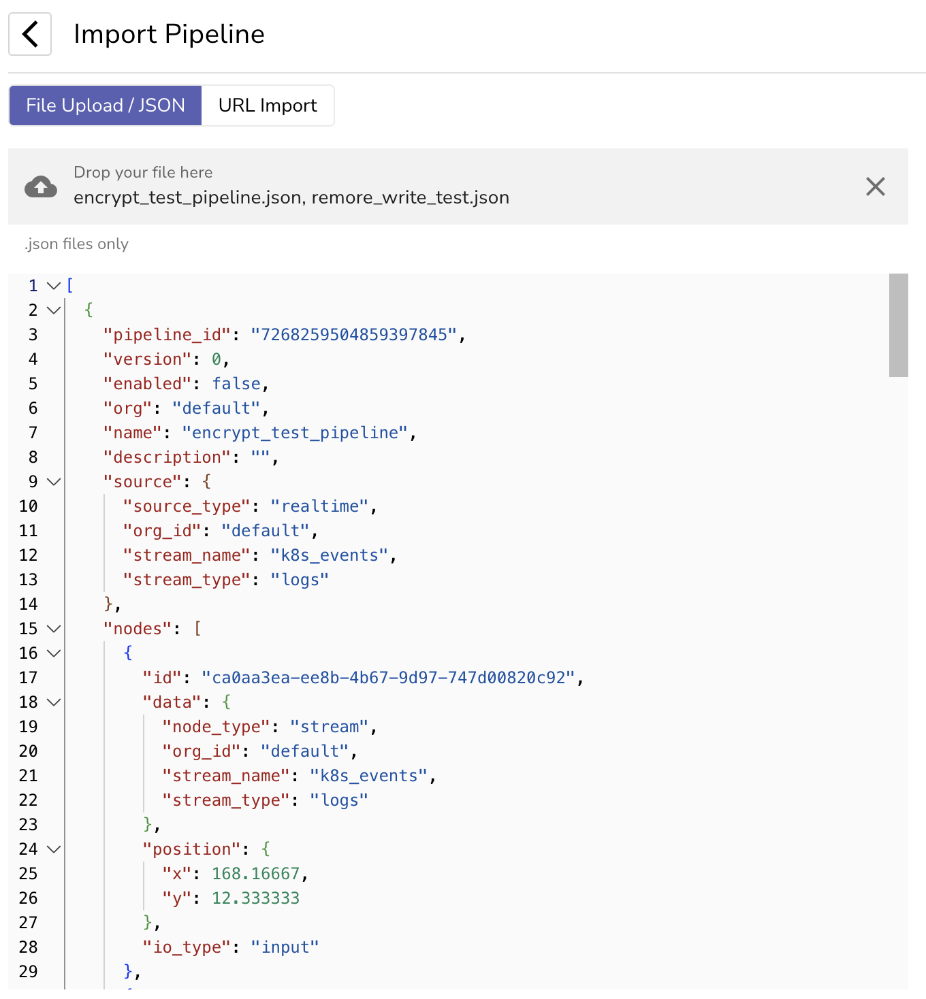
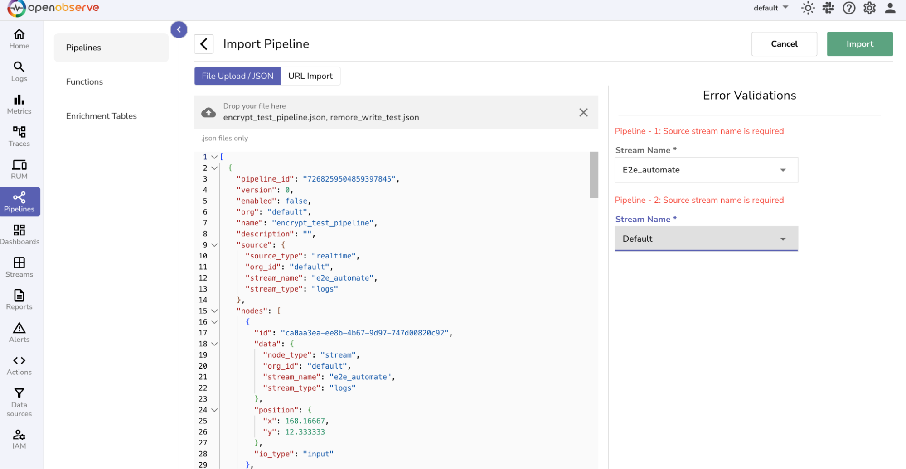

This guide explains how to import and export pipelines. Use this feature to replicate existing pipelines across environments without recreating them from scratch.


## Export a Pipeline

To export an existing pipeline configuration:

1. From the left navigation menu, go to **Pipelines**.  
2. In the **Pipelines** tab, locate the pipeline you want to export.   
3. In the **Actions** column of the pipeline you want to export, click the download icon.  

The downloaded `.json` file contains the pipeline configuration and can be used to import the pipeline into another environment.<br>
  

For example, exporting the pipeline `encrypt_test_pipeline` generates a JSON file similar to the following:  
```json  
{  
  "name": "encrypt_test_pipeline",  
  "stream_name": "k8s_events",  
  "stream_type": "logs",  
  "type": "realtime",  
  "nodes": [...],  
  "edges": [...],  
  "enabled": false  
}  
```

## Import a Pipeline

To import a previously exported pipeline:

1. Go to **Pipelines**.  
2. Click **Import Pipeline** in the top-right corner.<br>  
    
3. Choose one of the supported import methods:  

    - **Upload JSON Files**: Select one or more JSON files containing pipeline configurations from your local system.  
    - **Enter URL**: Provide a URL to fetch the pipeline configuration.  
    - **Paste JSON Object**: Copy and paste the JSON pipeline definition in the JSON editor.

<br>  
To import pipelines in bulk, choose multiple JSON files, as shown below:<br>  
  
4. Click **Import**.

## Handle Validation Errors

If any validation errors occur during import, refer to the following resolutions:

- **Pipeline name already exists:** Enter a unique pipeline name.  
- **Source stream name already exists**: Enter a unique source stream.   
- **Source stream type does not exist**: Enter stream type.    
- **Source time zone does not exist (for scheduled pipeline)**: Ensure the source time zone is accurate when you want to import scheduled pipelines.   
- **The SQL query does not exist (for scheduled pipeline):** Ensure the SQL query exists if you want to import scheduled pipelines.  
- **Destination stream type does not exist:** Enter the destination stream type.   
- **Organization ID does not exist:** Enter the organization ID.   
- **Function name does not exist:** Enter the function name  
- **Remote Destination does not exist:** Ensure the remote destination is accurate. 



The imported pipeline appears in the **Pipelines** tab.   

## Related Links
- [Manage Pipelines](Manage-Pipelines.md)