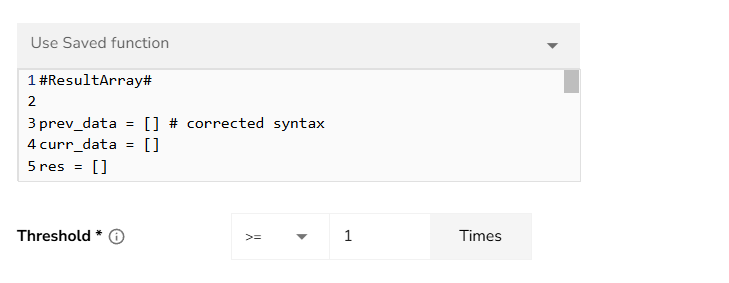
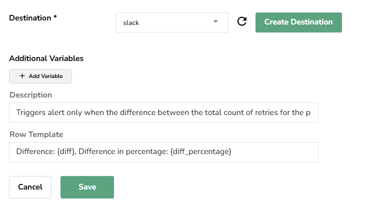

When you monitor logs, metrics, or traces, numbers alone do not tell the full story. Knowing how many events happened in the last few minutes or hours is helpful, but it is not enough. What matters more is understanding how these numbers compare to similar periods in the past.

For example, if you see 200 purchase retries in the last 30 minutes, is this normal? If your system typically has around 100 retries in that period, this means there is a 100% increase and likely requires immediate attention.

The Multi-window Selector in OpenObserve helps you compare the current period with one or more past periods. By making these comparisons, you can detect meaningful changes and avoid unnecessary noise in your alerts.

This guide will explain how the Multi-window Selector works and show you how to configure it step by step.

## How to Access The Multi-window Selector

You can apply the multi-window selector feature to both new and existing scheduled alerts in SQL mode. 

#### To access multi-window selector in new alerts: 

1. Select **Alerts**.   
2. Select the folder or create a new folder as per requirement.  
3. Click **Add Alert**.  
4. Select **Scheduled Alerts**.  
5. Select **SQL**.   
6. Navigate to the **Multi-window Selector** section.


#### To access multi-window selector in existing alerts: 

1. Select the existing alert from the **Alerts** page (the selected alert must be scheduled and created in the SQL mode). Apply the **Scheduled** filter to view all the Scheduled alerts. 
2. Click the edit icon.  
3. In the **Update Alert** page, navigate to the **Multi-window Selector** section.


## How to Use Multi-window Selector 

> **Use Case**: You want to monitor **purchase events where users had to retry the action (retry count > 0)**. Specifically, you want to check if the number of such purchase events has **increased by more than 5% in the last 30 minutes**, compared to the same 30-minute period yesterday. If yes, you want to receive an **alert by email** that clearly states the percentage increase, so you can take necessary actions.

Follow these steps to configure the **Multi-window Selector** feature in your scheduled alert:

#### Step 1: Write the SQL Query

**Tip**: Use the Logs page to write and test your SQL query. 

```sql

SELECT 

  histogram(_timestamp, '15 minutes') AS time_s,
  COUNT(_timestamp) AS cnt

FROM 

  "openobserve_app_analytics_log_stream"

WHERE 

  pdata_dr_level1_level2_level3_level4_level5_level6_level7_retry > 0
  AND eventtype = 'purchase'

GROUP BY 

  time_s
```
Explanation of the above SQL query:

- `histogram(_timestamp, '15 minutes')`: Buckets events into 15-minute intervals.  
- **Filters**: Only include events of type `purchase` that have retry count greater than zero.  
- **Group by**: Each time bucket.


#### Step 2: Define the Period

Specify the time range for which you want to evaluate the data (for example, the last 30 minutes).


#### Step 3: Select Multi-window

In the **Multi-window Selector** section, select the historical time window you want to compare against the current time window.

For example, if you want to compare the current 30-minute window with the same window from yesterday, select **1 day ago**.

In this case, the alert manager will run **two SQL queries** at runtime:

1. One for the **current time window** (for example, 9:30 AM – 10:00 AM, today).  
2. One for the **selected past time window** (for example, 9:30 AM – 10:00 AM, yesterday).

#### Step 4: Write the VRL Function 

> **What input does the VRL function receive?**<br>
> ​The output of your SQL query is the input to your VRL function.<br>
> When **Multi-window Selector** is used, OpenObserve passes the results of your SQL queries to your > VRL function as an **array of arrays**.
>
> Example: Let us say for the above two queries, we get the following query output:
>
>```
>[
>
>  [ // Current time window result (result[0])
>
>    { "time_s": "10:00", "cnt": 20 },
>
>    { "time_s": "10:15", "cnt": 23 }
>
>  ],
>
>  [ // Past time window result (result[1])
>
>    { "time_s": "10:00", "cnt": 40 },
>
>    { "time_s": "10:15", "cnt": 91 }
>
>  ]
>
>]
>```
> This query output becomes the input for the VRL function you will write. 
> Inside the VRL function, you can access:
>
> - `result[0]`: Current time window data  
> - `result[1]`: Past time window data

To start writing the VRL function for processing your SQL query results and performing the comparison, click the function toggle at the top of the SQL query editor.<br>

**Key points to know before writing the VRL function:**  

1. Always start your VRL function with `#ResultArray#` when using the **Multi-window Selector**.  
This ensures that your VRL function receives a **multi-dimensional array** input, where:

    - `result[0]` = current time window data  
    - `result[1]` = past time window data

2. The **special variable `.` (dot)** holds this input. It contains the entire query result. To make this input easier to work with, we **assign it to a variable called `result`** and ensure it is treated as an array: <br>
`result = array!(.)` <br>
Note that `array!(.)` tells VRL to ensure the input is treated as an array. If the input is not an array, VRL will throw an error to alert you. Always use `array!(.)` for clarity and safety.

**Tip**: Write and test your VRL function using the VRL playground in Logs page or [Vector.dev Playground](https://playground.vrl.dev/). 

**VRL function example**:
```
#ResultArray#

# Initialize variables

prev_data = []

curr_data = []

res = []

result = array!(.)

# Process if we have at least 2 windows of data

if length(result) >= 2 {

    today_data = result[0]

    yesterday_data = result[1]

    # Sum counts for both windows

    cnt_yesterday = 0.0

    cnt_today = 0.0

    for_each(array!(yesterday_data)) -> |index, p_value| {

        cnt_yesterday, err = cnt_yesterday + p_value.cnt

    }

    for_each(array!(today_data)) -> |index, p_value| {

        cnt_today, err = cnt_today + p_value.cnt

    }

    # Calculate difference and percentage

    if cnt_yesterday > 0.0 {

        diff = cnt_today - cnt_yesterday

        diff_percentage, err = (diff) * 100.0 / cnt_yesterday

        # Alert condition: if increase is more than 5%

        if diff_percentage > 5.0 {

            diff_data = { 

                "diff": diff,

                "diff_percentage": diff_percentage

            }

            temp = []

            temp = push(temp, diff_data)

            res = push(res, temp)

        }

    }

}

# Set the final result

. = res

.
```


**Understand the VRL Function Output**

The VRL function outputs:

- **Empty array** ([ ]): If the increase is **not** more than 5%.  
- **Non-empty array**: If the increase **exceeds** 5%. 

Example:

```
[

  [

    {

      "diff": 10,

      "diff_percentage": 10.0

    }

  ]

]
```

#### Step 5: Define the Threshold

Use the VRL function output to define the threshold.
Set the threshold as:

**Trigger when count of VRL output >= 1. This means:**

- If the VRL output array is **empty** -> count is 0 -> **no alert is sent**.  
- If the VRL output has **results** -> count is 1 or more -> **alert is triggered**.

Set the **Threshold** as **>= 1**

#### Step 6: Define the Frequency

Determines how often the alert manager runs the query throughout the day (e.g., every 30 minutes).


**Important:**

- Frequency determines **how often** the alert manager runs your queries.  
- Period defines **what time range** is checked at each run.

For instance:

- **Period**: Last 30 minutes
- **Frequency**: Every 30 minutes
- **Multi-window selector**: 1 day ago

At 10:00 AM, OpenObserve alert manager executes SQL for:

- Current window: 9:30 AM – 10:00 AM, today
- Past window: 9:30 AM – 10:00 AM, one day ago

At 10:30 AM, OpenObserve alert manager executes SQL for:

- Current window: 10:00 AM – 10:30 AM, today
- Past window: 10:00 AM – 10:30 AM, one day ago

#### Step 7: Select Destination

Specify where you want to receive the alert notification- email or webhook. 



#### Step 8: Create Row Template

Design the row template to customize the alert content.

Example:

Include fields from your VRL output such as:

- `diff` (difference in counts)  
- `diff_percentage` (percentage increase)

This ensures your email notification is informative and actionable.

Example row template:

```
Alert: Purchase events with retries increased by {{ diff_percentage }}%*
Details: Count difference: {{ diff }}
```

#### Step 9: Save the Alert

### FAQ

**What is a window in the Multi-window Selector?** <br>
A *window* is a specific time range of data. It depends on the period you set in the alert.
If you set the period to 4 hours, each window will cover exactly 4 hours of data.

- The **current window** is simply the most recent 4-hour block of time before the evaluation. If the current time is **April 10th at 4:00 PM**, then the current window covers **April 10th from 12:00 PM to 4:00 PM**.
- If you select **1 day ago** in the Multi-window selector, that window will cover the same 4-hour block, but from exactly one day earlier - **April 9th from 12:00 PM to 4:00 PM**.
- If you select **4 days ago,** it will cover the same 4-hour block, but from 4 days earlier - **April 6th from 12:00 PM to 4:00 PM**.
Every window you select is just a copy of the same time range (defined by the period), shifted back by the amount of time you choose.
<br>

**Does the period control the window length?**<br>
Yes. The period defines the duration of each window. If you set the period to 4 hours, then every window — whether it's the current window or any past window — will be exactly 4 hours long.

**Does the alert manager run multiple queries inside one window?** <br>
No. For each evaluation, the alert manager runs:

- One query for the current window
- One separate query for each additional past window you select

The alert manager does not run multiple queries within a single window. Each window is queried once at the time of evaluation.<br>
**Note that the time of evaluation is decided by the frequency you set in the alert settings.**
For example:

- If you set frequency to every 60 minutes, the alert manager runs these queries once every 60 minutes.
- If you set frequency to every 12 hours, it runs the queries every 12 hours.
So, frequency controls when the alert manager checks, and period controls what time range is checked at each evaluation.

**What happens if I forget to include `#ResultArray#` in my VRL function?** <br>
If you do not include `#ResultArray#`, your VRL function will receive a flat array:**  

```
[

  { "timestamp": "10:00", "cnt": 20 },

  { "timestamp": "10:15", "cnt": 23 },

  { "timestamp": "10:00", "cnt": 40 },

  { "timestamp": "10:15", "cnt": 91 }

]
```
You cannot distinguish current window from past window data from the above array.

