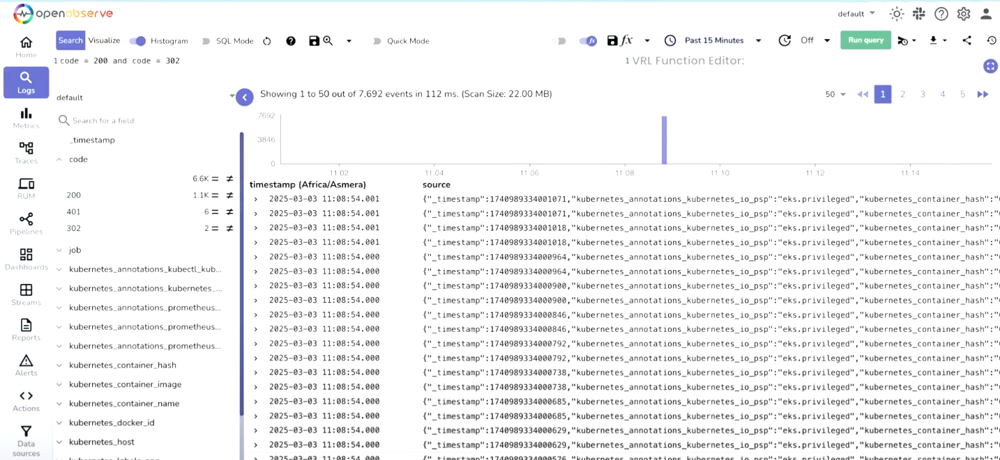
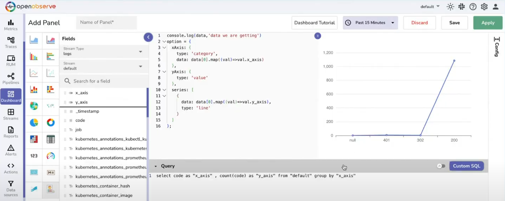
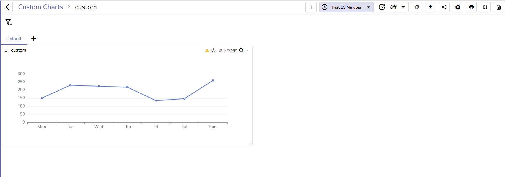

Custom charts in OpenObserve enable tailored visualizations of ingested data, helping users analyze trends, detect anomalies, and debug issues more efficiently. This feature extends OpenObserve’s 19 built-in chart types with advanced customization possibilities.

This guide shows how to set up custom charts, add event handlers, and create custom reusable functions for chart modification.

## Supported Chart Types

You can create and configure any chart supported by [ECharts](https://echarts.apache.org/examples/en/index.html). Additionally, you can mix and match multiple chart types in a single visualization as needed.

## Set Up Custom Charts

To create a custom chart:

### Step 1. Navigate to the Custom Chart Menu

1. Go to **Dashboards** from the left-hand navigation menu.
2. **For a new dashboard**: Create a new dashboard for the custom chart.<br>**For an existing dashboard**: Select the dashboard and add a new tab.
3. Click **Add Panel**.
4. Enter a name for the panel.
5. From the list of charts, select **Custom Chart**.

### Step 2: Select and Structure the Data

1. Under **Fields**, select the data stream that contains the required data to create the graph.
2. In the **Query** tab, write a SQL query to fetch the data from the selected stream. Structure the query so that it returns the fields you want to plot. For instance, to compare different status codes, query the count per code.

**Note**: The output of your query is available in the `data` object as an array. By selecting and structuring the data in this step, you lay the foundation (the `data` object) for your custom chart.

The following images display an example of a query that fetches status codes and their counts from the `default` stream, with the X-axis representing the status codes and the Y-axis representing their counts.



### Step 3: Configure the Chart

In OpenObserve’s custom chart editor, write a JavaScript function that takes the `data` oject and constructs an `option` object defining how the chart should look and behave​.

**Note**: All configurations required for the chart, such as axes, series, titles, tooltips, and other properties must be defined in the `option` object.

This chart configuration includes several components:

- **X and Y Axes**: Define the x-axis and y-axis of your chart. Ensure that you specify the axis type. For example, you might set `option.xAxis = { type: 'time' }` and `option.yAxis = { type: 'value' }`. You can further add labels. For instance, `option.yAxis = { type: 'value', name: 'Error Count' }`.

**Note**: If your chart does not require axes (such as in a [pie chart](https://echarts.apache.org/examples/en/index.html#chart-type-bar)), you can omit or adjust them accordingly.

- **Series and Chart Type**: Define one or more series to plot, along with the chart type for each series. Each series can represent a set of data points on the chart. For example, a single line graph can have one series (type `line`). However, comparing data points over time may require two series (perhaps both `line`, each with its own data array).<br>
Using the query results in the `data` object, populate the series with the values for each data point, as shown in the image above.

For more examples, refer to [ECharts](https://echarts.apache.org/examples/en/index.html).

### Step 4: Preview and Save the Chart

1. After writing your custom chart code (using the `data` object and constructing the `option`object), use the time filter to ensure that the data is selected for the correct period.
2. Click **Apply** to preview the chart. 
3. If everything looks good, click **Save**.

The custom chart renders on your dashboard and updates in real-time or at the configured refresh interval.


## Custom Charts with Event Handlers

Users can define event handlers (e.g., `click`, `mousemove`, `mouseout`, `legendchanged`, etc.) to make the chart interactive. Event handlers should be added under the `o2_events` property within the `option` object. Each event type should be mapped to a function reference that receives:

- `params` → Event-specific parameters
- `chart` → Reference to the chart instance

**Example: Adding Click and Mouse Move Events**

```javascript linenums="1"
option = {
    xAxis: { type: "category", data: ["A", "B", "C"] },
    yAxis: { type: "value" },
    series: [{ type: "bar", data: [10, 20, 30] }],
    o2_events: {
        click: handleClick,
        mousemove: handleMouseMove
    }

};

function handleClick(params, chart) {
    console.log("Clicked on:", params, chart);
}

function handleMouseMove(params, chart) {
    console.log("Mouse moved over:", params);
}
```

## Using `customFn` for Reusuable Functions

Users can define reusable functions that can be accessed at runtime for event handling and chart modifications. These functions should be defined within the `customFn` property in the `option` object. They can be accessed within event handlers using `chart._model.option.customFn.functionName`.

**Example: Formatting Data Using `customFn`**

``` javascript linenums="1"
option = {
    xAxis: { type: "category", data: ["A", "B", "C"] },
    yAxis: { type: "value" },
    series: [{ type: "bar", data: [10, 20, 30] }],
    customFn: {
        formatData: formatData
    }
};

function formatData(data) {
    return data.map(item => item * 2);
}
// Using customFn inside an event

function handleClick(params, chart) {
    const formattedData = chart._model.option.customFn.formatData([10, 20, 30]);
console.log("Formatted Data:", formattedData);
}
```
Here, `formatData` doubles the values in the dataset. The function is stored in `customFn` and can be accessed inside event handlers dynamically.

