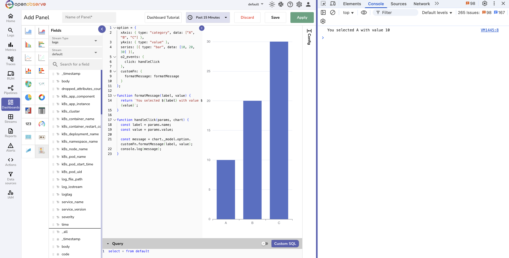

This guide shows how to make your [custom charts](what-are-custom-charts.md) interactive using event handlers and reusable custom functions (customFn).

## What Are Event Handlers 

Event handlers let you define what happens when a user interacts with the chart, such as clicking or hovering over a data point. Use event handlers in the custom chart logic to display messages, log actions, or apply filters based on user input.

Common event handlers: 

- `click`: Clicking a chart element  
- `mousemove`: Hovering over a data point  
- `legendchanged`: Selecting or unselecting a legend item

Before you begin, note the following: 

- Charts in OpenObserve use an [`option` object](what-are-custom-charts.md/#the-option-object).  
- Use the `o2_events` block to specify the event type, such as `click`.  
- Associate the event with a function that will run when the event occurs.

## How to Create Event Handlers

### Step 1: Create a basic chart with labels and values

```linenums="1"

option = {  
  xAxis: { type: "category", data: ["A", "B", "C"] },  
  yAxis: { type: "value" },  
  series: [{  
    type: "bar",  
    data: [10, 20, 30]  
  }]  
};  
```  
At this point, clicking on the chart does nothing. 

### Step 2: Add the `o2_events` block to the chart logic
This tells the chart what kind of user action (event) you want to respond to.  
Here, we want to respond to a `click` event:

```linenums="1"

option = {  
  xAxis: { type: "category", data: ["A", "B", "C"] },  
  yAxis: { type: "value" },  
  series: [{ type: "bar", data: [10, 20, 30] }],  
  o2_events: {  
    click: handleClick  
  }  
};  
```  
To make the above code snippet work, you need to define the `handleClick` function.

### Step 3: Write the event handler function  
This function runs every time the user clicks a bar.

```linenums="9"  
function handleClick(params, chart) {  
  console.log("You clicked:", params.name, params.value);  
}  
```

#### What is `params`?  
`params` contains information about the thing the user clicked, such as: 

* `name`: The label of the bar (for example, A)  
* `value`: The number shown on the bar (for example, 10)

#### What is `chart`?  
This is a reference to the whole chart. You can use it to access other parts of the chart configuration such as to call [custom functions](#what-are-custom-functions). 

### Step 4: Apply and test  
Click **Apply** in the OpenObserve custom chart editor.  
Then click on a bar and check the browser console.   
You should see something like:   
```  
You clicked: A 10  
```  


### Step 5 (optional): Add more events  
Further, you can add more event handlers such as `mousemove`, `legendchanged` like this:  

```linenums="1"  
o2_events: {  
  click: handleClick,  
  mousemove: handleHover  
}  
```

## What Are Custom Functions

Custom functions (customFn) are special sections inside the chart’s `option` object where you can define reusable functions.

These functions can be used:

- To format messages  
- To apply logic such as filters  
- To keep your event handlers simple

## How to Create Custom Functions

**Example**: You have a chart showing bars for A, B, and C. When the user clicks on a bar, you want to format the output like:   
```  
You selected A with value 10  
```  
You can write that logic as a custom function and call that function from the `click` event handler.

### Step 1: Add a `customFn` block inside your chart’s `option` object

```linenums="1"

option = {  
  xAxis: { type: "category", data: ["A", "B", "C"] },  
  yAxis: { type: "value" },  
  series: [{ type: "bar", data: [10, 20, 30] }],  
  o2_events: {  
    click: handleClick  
  },  
  customFn: {  
    formatMessage: formatMessage  
  }  
};

```  
> ***Note**: `formatMessage` is the name of your reusable function.

### Step 2: Write the custom function  
This function takes a label and value, and returns a readable message.

```linenums="12"
function formatMessage(label, value) {  
  return `You selected ${label} with value ${value}`;  
}  
```  
> **Note**: You can write this function anywhere in the script, as long as it is available when the chart runs.

### Step 3: Update the event handler to use `customFn`  
Update your `click` handler to call this reusable function:

```linenums="15"
function handleClick(params, chart) {  
  const label = params.name;  
  const value = params.value;

  const message = chart._model.option.customFn.formatMessage(label, value);  
  console.log(message);  
}  
```

#### How to call a customFn  
To call a function you defined in `customFn`, use the following format: `chart._model.option.customFn.formatMessage(...)`

> **Note**:   
> You need to pass in the label and value that the user clicked.  
> The result is logged to the console.

### Step 4: Apply and test  
Click **Apply**.  
Then click a bar in the chart.  
The browser console will show:

```  
You selected A with value 10  
```



## Troubleshooting

- When the chart does not respond to clicks:

    - Ensure `o2_events` is defined in the `option` object.  
    - Confirm the handler function such as handleClick is defined correctly.

- When `customFn is not a function` error occurs:

    - Ensure the function is defined outside the `option` object.  
    - The name in `customFn` must match the actual function name. 

- When only one event works when multiple are defined:

    - Verify each event uses a uniquely named handler.  
    - Ensure all handlers are declared before the chart is rendered. 

