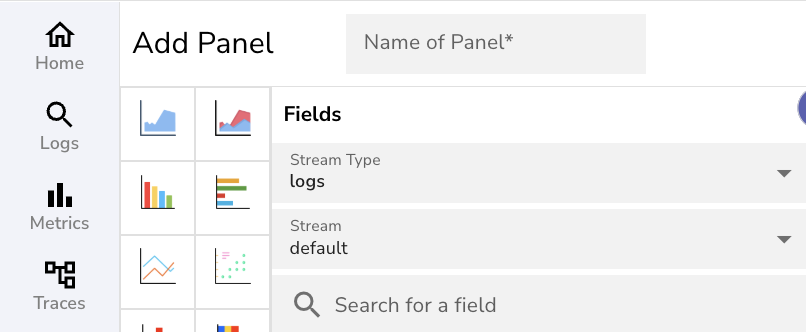
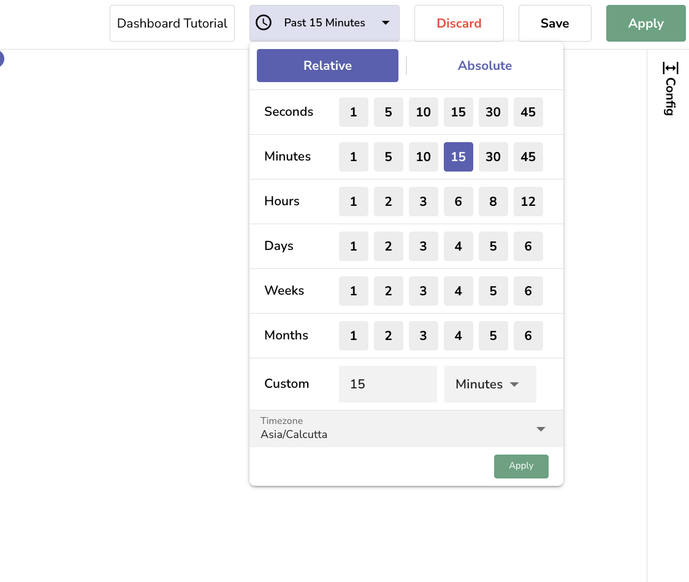

The following step-by-step instructions show how to build a [custom chart that expects nested data](what-are-custom-charts.md/#how-to-check-the-data-structure-a-chart-expects). 

This example starts with flat data from the `default` stream, fetched and prepared using SQL, and reshaped and rendered using JavaScript. [Learn more about data preparation and reshaping for custom charts](what-are-custom-charts.md/#build-the-chart). 

## Use Case
Build a custom **Sunburst chart** to visualize how **query execution time** is distributed across different **organizations** and **search types**.
The goal is to understand:

- Which organization generates the most query load  
- How that load is split across dashboards, logs, and alerts  
- Whether certain usage patterns need optimization or resource allocation


## Step 1: Choose the Chart


To build a custom chart, you need to bridge two things:

- **What data you already have**: This is the structure of your ingested data, which is usually flat.
- **What the chart expects**: Each chart type needs data in a specific format. Some charts expect flat data, while others require nested data.

> **Note**: Understanding both is important because it helps you write the right SQL query, [prepare](what-are-custom-charts.md/#build-the-chart) the data through grouping or aggregation, [reshape](what-are-custom-charts.md/#build-the-chart) the results to match the chart’s structure, and map them correctly in the JavaScript code that renders the chart. 

## Step 1: Understand the Ingested Data
OpenObserve stores ingested data in a flat structure.  

**Example:** In the following dataset, each row represents a single event or query log, with its own timestamp, organization ID, search type, and query duration.

```linenums="1"
  { "_timestamp": "2025-05-12T09:00:00Z", "organization_id": "test", "search_type": "logs", "query_duration": "10h 51m 13s" },
  { "_timestamp": "2025-05-12T09:01:00Z", "organization_id": "production", "search_type": "alerts", "query_duration": "11h 46m 00s" },
  { "_timestamp": "2025-05-12T09:02:00Z", "organization_id": "test", "search_type": "alerts", "query_duration": "7h 44m 21s" },
  { "_timestamp": "2025-05-12T09:00:00Z", "organization_id": "test", "search_type": "logs", "query_duration": "0h 58m 02s" },
  { "_timestamp": "2025-05-12T09:02:00Z", "organization_id": "production", "search_type": "logs", "query_duration": "11h 24m 37s" },
  { "_timestamp": "2025-05-12T09:00:00Z", "organization_id": "production", "search_type": "alerts", "query_duration": "8h 25m 29s" },
  { "_timestamp": "2025-05-12T09:01:00Z", "organization_id": "production", "search_type": "alerts", "query_duration": "2h 30m 01s" },
  { "_timestamp": "2025-05-12T09:00:00Z", "organization_id": "production", "search_type": "alerts", "query_duration": "4h 10m 21s" },
  { "_timestamp": "2025-05-12T09:02:00Z", "organization_id": "production", "search_type": "logs", "query_duration": "4h 40m 34s" },
  { "_timestamp": "2025-05-12T09:01:00Z", "organization_id": "test", "search_type": "dashboards", "query_duration": "3h 33m 28s" }
```

**Note**: To view the ingested data, go to the **Logs** page and run the query against the stream for a selected time range. 

## Step 2: Identify the Expected Data Structure

Before starting, [identify what structure the chart expects](what-are-custom-charts.md/#how-to-check-the-data-structure-a-chart-expects). 

Sunburst chart expects data to be in nested format or parent-child hierarchy. Each parent (`organization_id`) should contain its children (`search_types`), each with a value.

## Step 3: Fetch and Prepare the Data

In the [**Add Panel**](what-are-custom-charts.md/#how-to-access-custom-charts) page, under **Fields**, select the desired stream type and stream name. 
 

Write a SQL query in the Query Editor to fetch and prepare the data: 

- Filter out incomplete or irrelevant entries.  
- Convert duration strings (e.g., 9h 44m 02s) into numeric values (e.g., 35042 seconds).  
- Aggregate values for matching categories (e.g., same organization_id and search_type).  
- Ensure consistent field names so the reshaping logic works without errors. 

**SQL Query**

```linenums="1"
SELECT
  organization_id,
  search_type,
  SUM(
    split_part(query_duration, 'h', 1)::int * 3600 +
    split_part(split_part(query_duration, 'h ', 2), 'm', 1)::int * 60 +
    split_part(split_part(query_duration, 'm ', 2), 's', 1)::int
  ) AS total_seconds
FROM
  "default"
WHERE
  query_duration IS NOT NULL
  AND organization_id IS NOT NULL
  AND search_type IS NOT NULL
GROUP BY
  organization_id,
  search_type;
```

Select a time range to fetch the relevant dataset for your chart.



**Expected Query Result**

```linenums="1"
data = [[
  {
    "organization_id": "test",
    "search_type": "logs",
    "total_seconds": 42555
  },
  {
    "organization_id": "production",
    "search_type": "alerts",
    "total_seconds": 96711
  },
  {
    "organization_id": "test",
    "search_type": "alerts",
    "total_seconds": 27861
  },
  {
    "organization_id": "production",
    "search_type": "logs",
    "total_seconds": 57911
  },
  {
    "organization_id": "test",
    "search_type": "dashboards",
    "total_seconds": 12808
  }
]];
```

**Note**: OpenObserve stores the result of the query in the [`data` object](what-are-custom-charts.md/#the-data-object) as an array of an array.

## Step 4: Inspect the Queried Data

Inspect the queried dataset before reshaping:

```linenums="1"
console.log(data);
console.log(data[0]);
```

This helps confirm:

- If the field names are correct  
- If there is any inconsistencies or formatting issues  
- If the data requires any preparation before reshaping

## Step 5: Reshape Data Into Nested Structure

In the JavaScript editor, write a script to convert the queried result into a nested array suitable for a Sunburst chart:

```linenums="1"
const grouped = {};

data[0].forEach(row => {
  if (!grouped[row.organization_id]) {
    grouped[row.organization_id] = {
      name: row.organization_id,
      children: []
    };
  }
  grouped[row.organization_id].children.push({
    name: row.search_type,
    value: row.total_seconds
  });
});

const treeData = Object.values(grouped);

```

Note: In the `option` object, use the reshaped `treeData` array as the data field in your chart configuration.

## Step 6: Render the Chart

Construct the [`option` object](what-are-custom-charts.md/#the-option-object) in the JavaScript code to define the reshaped dataset and configure how the chart should appear. 

```linenums="17"
option = {
  tooltip: {
    trigger: 'item',
    formatter: '{b}: {c} seconds'
  },
  series: [{
    type: 'sunburst',
    radius: [0, '90%'],
    sort: null,
    label: {
      rotate: 'radial'
    },
    data: treeData
  }]
};
```

**Note**: Further, you can enhance the chart with [event handlers and reusable functions](custom-charts-event-handlers-and-custom-functions.md).

## Step 7: View Results

Click **Apply** to generate the chart. 

If the query and JavaScript logic are correct, the chart appears in the preview area.


<br>

### Understand the Chart

The above Sunburst chart shows a breakdown of total query time across organizations and their search types.

- The inner ring shows the organizations (test, production).  
- The outer ring shows search types (logs, alerts, dashboards) under each organization.  
- The size of each slice reflects the total duration (in seconds) for that group, larger slices mean more total query time.  
- Hover over any slice to see a tooltip showing the exact total duration in seconds.

Use the chart to identify which organizations or search types consume the most query time. Large slices may indicate areas that need performance tuning or more resources.

## Troubleshoot

Use the following guidance to identify and fix common issues when working with custom charts:

**1. `No data found`**  
**Cause**: The SQL query did not return any results.   
**Fix:** 

- Confirm the selected time range includes data.  
- Check that the stream name and field names are correct.  
- Run the query in the Logs view to verify that results are returned.

**2. `Uncaught ReferenceError: option is not defined`**  
**Cause:** The chart configuration was not defined correctly.  
**Fix:** 

- Ensure `option = {...}` is defined at the end of your JavaScript.  
- Do not rename the option variable or wrap it in a function or condition.

**3. Unsafe code detected: Invalid JavaScript syntax.**  
**Cause:** There is a syntax error in your JavaScript.  
**Fix:** 

- Check for missing or extra commas, brackets, or quotation marks.  
- Open your browser's developer console to locate the error.  
- Use `console.log()` to test your script step by step.

**4. Chart Not Rendering:**   
**Cause**: The query returned data, but the chart did not render.  
**Fix**: 

- Use `console.log(data[0])` to confirm that the dataset is not empty.  
- Make sure the field names in your script match the query output.
