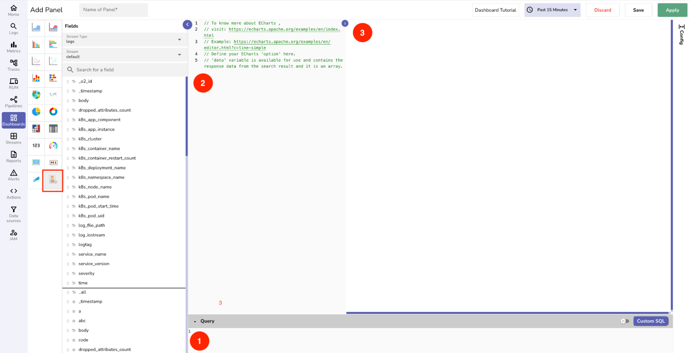

Custom charts in OpenObserve let you create visualizations by using SQL to query the data and JavaScript to define how the chart appears. 
Custom charts are useful when other built-in chart types do not meet your needs.

## How to Access Custom Charts

1. Go to **Dashboards** from the left-hand navigation menu.  
2. Do one of the following:   

    - **To add the chart to a new dashboard:** Click **Create Dashboard**, enter a dashboard name, description, select folder, and click **Save**.  
    - **To use an existing dashboard:** Select the dashboard from the list. You can optionally add a new tab to organize your panels.  

3. Click **Add Panel**.  
4. Enter a name for the panel.  
5. In the **Add Panel** page, select **Custom Chart** from the list of charts.



After selecting **Custom Chart**, the screen displays: 

1. A SQL editor  
2. A JavaScript editor  
3. A chart preview panel

Use these options to write your query, define how the chart should be displayed, and preview the output.

## What Data Do We Have

OpenObserve stores ingested data in a flat structure.   
Use the **Logs** page to view the ingested data for a selected time range. 

## What Data Does the Chart Expect

Using custom charts, you can create and configure any chart supported by [ECharts](https://echarts.apache.org/examples/en/).  
Each chart type expects data in a specific structure and format.  
Depending on the chart, you may need to prepare the data to ensure the correct data types, and reshape it to match the structure the chart requires.

### How to Check the Data Structure a Chart Expects

To identify the data structure expected by a chart: 

1. Go to [https://echarts.apache.org/en/option.html#series](https://echarts.apache.org/en/option.html#series).  
2. Find your chart’s series type.  
   Example: `series-line`, `series-bar`, `series-sunburst`, `series-tree`, `series-graph`, etc.  
3. Click the chart type.  
4. Navigate to the `data` field under that series type and observe the following: 

    - **Flat Data:** If it is a flat array of values or objects (data: [1, 2, 3] or [{name, value}]).   
    - **Nested Data:** If it has children: [...] inside data items. 

## Prepare and Reshape Data

After you identify whether the chart expects flat or nested data, you can determine how to prepare and reshape your data.

- **Preparation** is done using SQL. It includes filtering, aggregating, and converting values (e.g., durations to seconds). The output gets stored into the [data object](#heading=h.v1k313w3r22s).  
- **Reshaping** is done using JavaScript. It is needed only when the chart expects nested structure (e.g., parent–child). Use JavaScript to convert flat records in the `data` object into the nested data format required by the chart. For charts that expect flat data, no reshaping is needed. 

## The `data` Object 

OpenObserve stores the query result in a global object called ``` data` ``. This is always an **array of an array**:

```linenums="1"
data = 
[
  [ /* all queried data for the selected time range */ ]
]
```

- `data[0]` contains the result set of your query which is an array of rows.  
- Each item in `data[0]` is an object representing a single row.

## The `option` Object

In the JavaScript editor, you must construct an object named `option`. 
This `option` object defines how the chart looks and behaves. 

Use your query results (`data[0]`) to populate fields in the `option` object. All chart settings, such as `axes`, `series`, `titles`, `tooltips`, etc., must be defined in this `option` object. 

#### Components of the `option` Object

Here are the main components of the `option` object:

**1. `title`: Sets the chart’s title.**

``` linenums="1" 
option.title = { text: "My Chart" };  
```  
**Note**: You can also include subtitles, alignment, and styling.

**2. `tooltip`: Enables hover-over tooltips.**  
```linenums="1"  
option.tooltip = { trigger: 'axis' }; // for line/bar charts  
option.tooltip = { trigger: 'item' }; // for pie or treemap charts  
```  
**Note**: Use 'axis' to show tooltips along axes and 'item' to show them per slice or node.

**3. `legend`: Displays the list of series (or categories) in the chart.**

```linenums="1"  
option.legend = {   
  data: ['Series 1', 'Series 2'],  
  orient: 'horizontal'   
};  
```  
**Note**: The legend helps users toggle visibility for multi-series charts.

**4.`xAxis` and `yAxis`:** Configure the axes for charts like bar or line.

```linenums="1"  
option.xAxis = { type: 'category', data: [...] };  
option.yAxis = { type: 'value', name: 'Count' };  
```  
**Note**: 

- Use `type: 'category'` for named groups like days or statuses.  
- Use `type: 'time'` for timestamps.  
- Use `type: 'value'` for numeric values.  
- Some charts (like pie or sunburst) do not use axes. In those cases, omit these fields.

**5. `series`: Defines what data to plot and what type of chart to use.**  
```linenums="1"  
option.series = [{  
  type: 'bar',  
  name: 'My Values',  
  data: [ /* values go here */ ]  
}];  
```  
**Note:** 

- Use `type: 'line'` for line charts.  
- Use `type: 'bar'` for bar charts.  
- Use `type: 'pie'`, `'treemap'`, or `'sunburst'` for hierarchical charts.  
- You can add multiple series to show multiple lines or bars in one chart. Use your query result (data[0]) to build each series. For example:

```linenums="1"  
option.series[0].data = data[0].map(row => row.count);  
option.series[0].name = 'Errors';

```

## How Does Custom Charts Work

Creating a custom chart involves the following steps:

1. Check what structure and data types the chart expects.  
2. Select the stream to query.  
3. Write a SQL query to prepare the data.  
4. Reshape the result using JavaScript if needed.  
5. Define the chart using the option object.  
6. Apply changes to preview the chart.

## Next Steps

- [Custom Charts: Flat Data](custom-charts-flat-data.md)  
- [Custom Charts: Nested Data](custom-charts-nested-data.md)  
- [Custom Charts: Event Handlers and Reusable Function (CustomFn)](custom-charts-event-handlers-and-custom-functions.md) 
