This guide explains how to use and manage panels in the dashboard. It includes features available in the panel toolbar, step-by-step instructions, and troubleshooting tips for common issues.

The panel toolbar offers the following controls to adjust, organize, and customize your panels:

## Viewing and Refresh Controls  
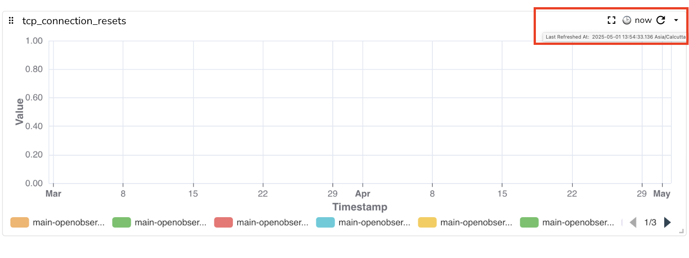

### Full Screen Mode  
Maximizes the panel to cover the entire display, providing an expanded view.  
**How to Use**:

- To expand the view, click the **Full Screen Mode** button in the panel toolbar.  
- To exit **Full Screen Mode**, press **Escape** on your keyboard. 

### Information Icon
The information icon on panel shows the description of the panel.    
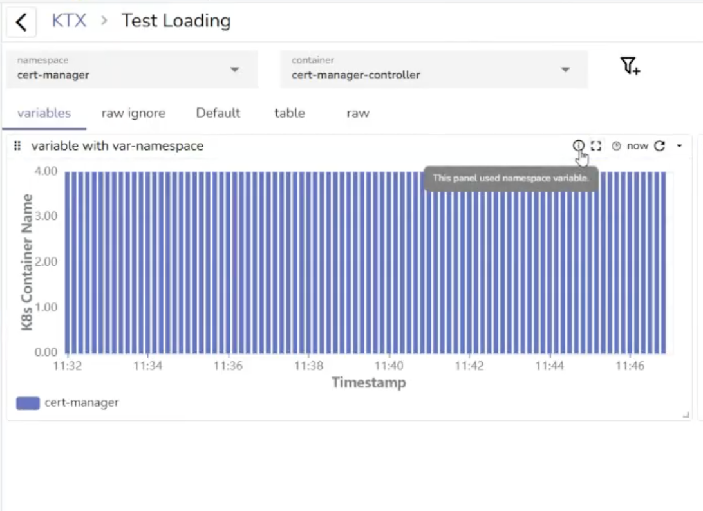  

**To add, edit, or remove a panel description:**

1. In the panel toolbar, open the dropdown menu and select **Edit Panel**.  
2. On the right side of the screen, select the **Config** tab.  
3. Under **Description**, enter, update, or delete the panel description as needed.  
4. Select **Apply** to save your changes.

### Last Refreshed At  
Displays the timestamp of when the panel’s data was last updated.   
**How to Use:** Hover over the timestamp icon to view the time when the panel was last refreshed. 

### Refresh  
Reloads the panel to display the most recent data.   
**How to Use:** Click the **Refresh** icon in the panel toolbar to reload the data.    

### Cached Data Warning
Alerts the user that the displayed data is not up-to-date with the selected time range, and the data may need to be refreshed for accuracy.  
To view the most up-to-date data, click **Refresh** to reload the panel.
 

## Panel Configuration and Layout  

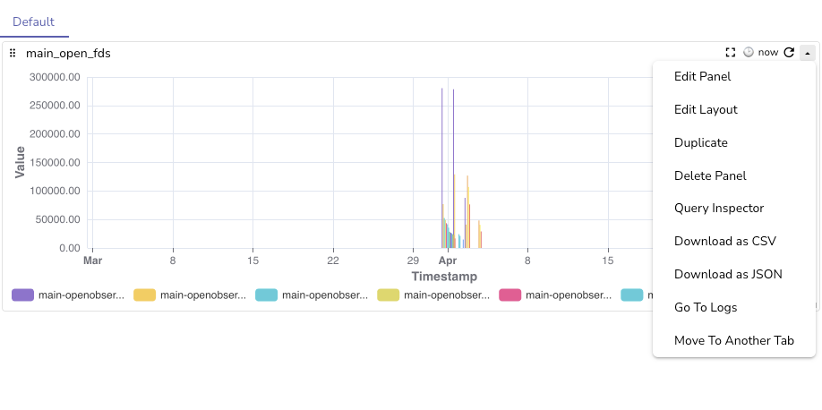 
### Edit Panel  
Allows you to modify the panel’s data, configuration settings, filters, query, and the chart.
### Edit Layout  
Allows you to modify the height of the panel.    
**How to Use:**   
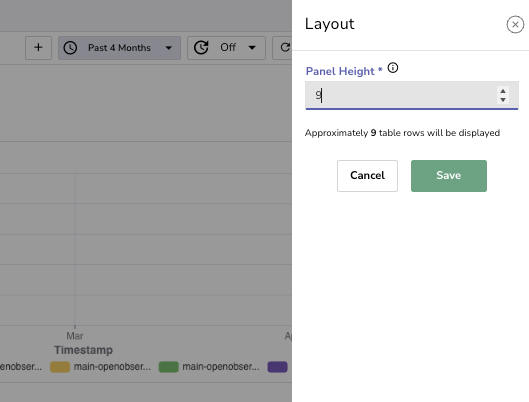

1. Click **Edit Layout** to open the layout configuration option.  
2. Adjust the **Panel Height** as required.  
3. Click **Save** to apply the changes.

### Adjust Size and Position 
Allows you to resize and reposition the panel using the available drag handles.   
**How to Use:**

- To adjust the position, click and drag the option at the top left corner of the panel.  
- To resize the panel, click and drag the arrow at the bottom right corner to adjust the panel’s height and width.

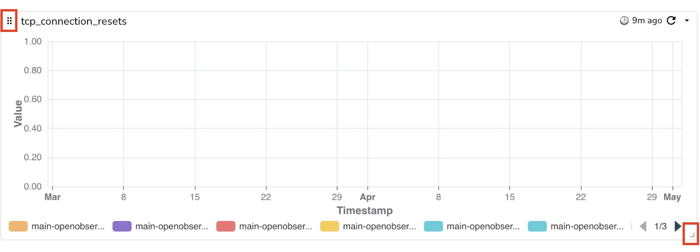

## Panel Lifecycle Management  
### Duplicate  
Creates another version of the panel for parallel usage or testing.

### Delete Panel  
Removes the panel from your dashboard.   

### Move to Another Tab  
Moves the panel to a different tab.  
**How to Use:** Click **Move to Another Tab**, select or create a new tab for the panel, and click **Move**.  
  

## Data Analysis and Export   
### Query Inspector
Allows you to view the query, its start and end time, query type, and variables. To modify the query, select the **Edit Panel** option.  
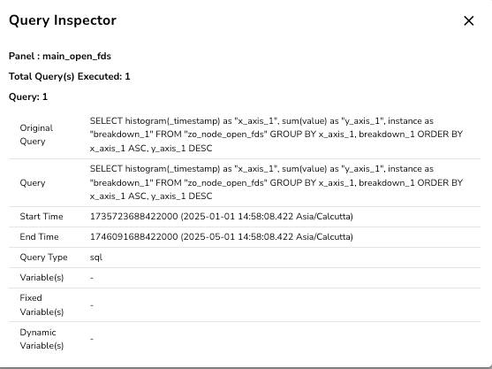

## Download as CSV 
Exports the panel’s data to a CSV file. 

### Download as JSON 
Exports the panel’s data to a JSON file. 
### Go to Logs 
Opens the logs related to the panel’s data.  
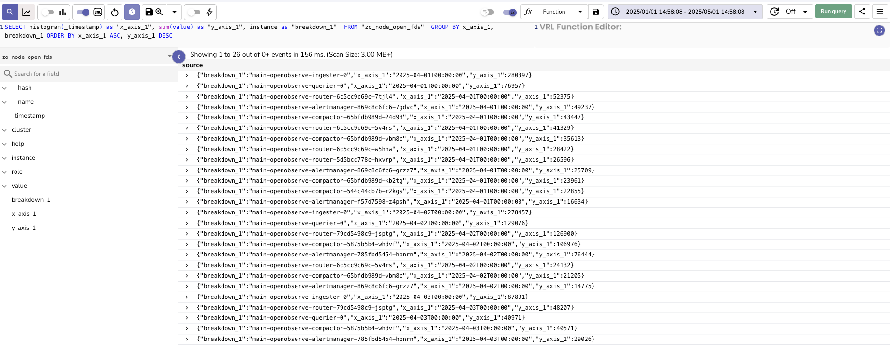  

## Annotations  
Allows you to add notes to selected data points or time ranges across multiple panels. This helps you highlight key insights or events in your data.  

### Add Annotations  
1. **Enable Annotation Mode:** 

    - The annotation button will appear when the panel contains time-series data.  
    - Click the annotation button to enter **Annotation Mode.**

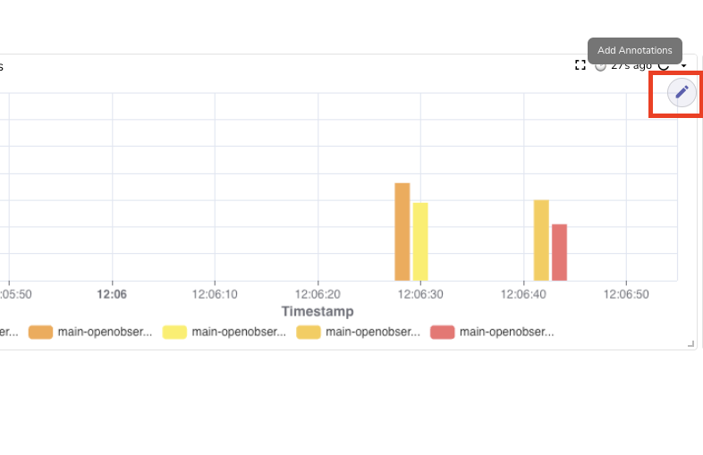

2. **Select Data Points or Time Ranges:** 

    - Click a single data point to place the annotation at that specific point.  
    - Select a range of data points to apply the annotation across the entire selected range.  

3. **Edit the Annotation:** 

    -  In the **Edit Annotation** popup, provide a title (mandatory) and a description (optional) for your annotation.
    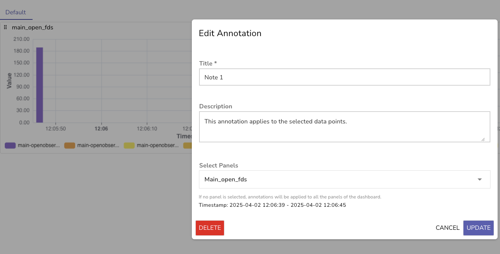

4. **Select Panels:**

    - Use the dropdown menu to select panels. You can apply annotations across multiple panels based on your selection.    
    - If you do not select any panel, the annotation applies to all panels for the selected time range, within the dashboard by default.
    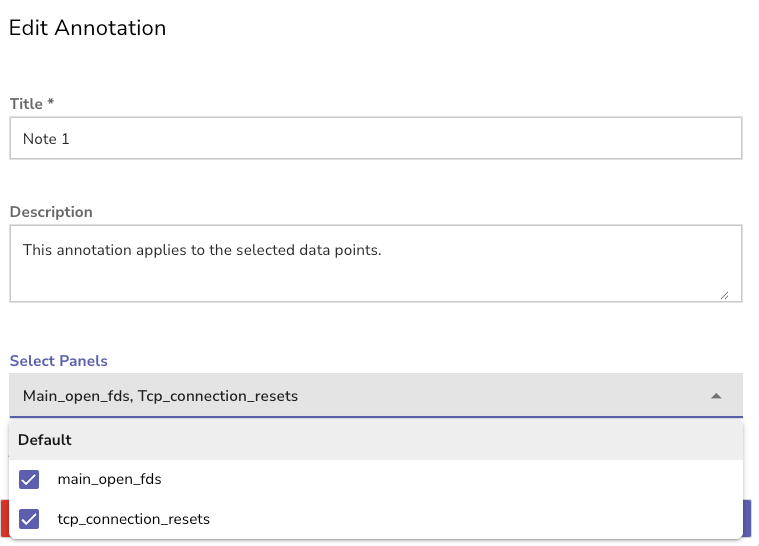

5. **Save Annotation.**

### Delete Annotations
  
1. Enable **Annotation Mode.**  
2. Select the annotation in the panel.   
3. In the **Edit Annotation** pop-up, click **Delete** and confirm.  

  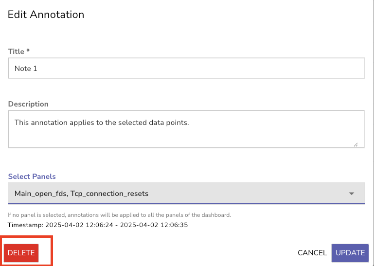

