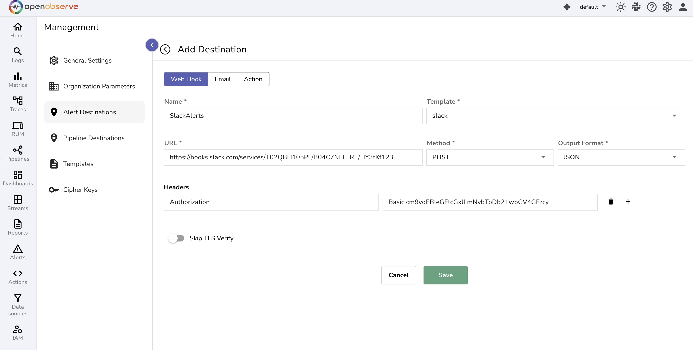

# Alert Destinations
In OpenObserve, **Alert Destinations** enables users to set up notification channels for alert messages. These destinations define where and how notifications will be delivered when alerts are triggered. Alert destinations are reusable, allowing them to be associated with multiple alerts for efficient management.

The **Alert Destinations** section provides three configuration options:

1. **Webhook**: Sends a JSON payload to a specified HTTP endpoint such as Slack webhook URL.
2. **Email**: Sends a formatted email to predefined recipients.
2. **Actions**: Executes a custom Python script packaged and uploaded by the user.  

Below is a detailed guide on how to configure alert destinations in OpenObserve.

## Configure Webhook Destinations

Webhooks are ideal for integrating OpenObserve alerts with third-party platforms, such as Slack, Microsoft Teams, or custom systems. Follow these steps to configure a Webhook destination:

1. In OpenObserve, go to **Management** from the top navigation bar.
2. Select **Alert Destinations**.
3. Select the **Webhook** tab.
4. Enter a descriptive name for the Webhook destination such as **SlackNotifications**. 
> Note: Characters like :, ?, /, #, and spaces are not allowed.
5. Choose a template from the dropdown menu. Refer to [Templates](templates.md) to create or manage templates.
6. Specify the Webhook endpoint URL where notifications will be sent.
7. Select the HTTP method depending on the Webhook's requirements.
8. Choose **JSON** unless the receiving system explicitly requires **NDJSON** format.  
> Why Output Format Matters <br>
> You define where the alert should be sent — this is the alert destination. <br>
> OpenObserve sends the alert to that destination — which is a remote server. <br>
> The remote server expects the payload in a specific format. <br>
> You choose JSON or NDJSON accordingly. <br>
> **Example:** <br> 
> **If the destination is a Slack webhook, choose JSON.** <br>
> **If the destination is another OpenObserve instance, choose JSON.** <br>
> **If the destination is a Splunk HTTP Event Collector (HEC) endpoint, choose NDJSON.** <br>
>
9. Under **Headers**, add custom headers in key-value format such as authentication tokens or content type.
10. Enable the **Skip TLS Verify** option if the endpoint uses self-signed certificates or if you want to bypass SSL verification.
9. Click **Save** to create the Webhook destination.



### Example

- **Name**: Slack Alerts  
- **Template**: SlackTemplate  
- **URL**: `https://hooks.slack.com/services/T02QBH105PF/B04C7NLLLRE/HY3fXf123`  
- **Method**: POST
- **Output Format**: JSON  
- **Headers**: 

    - **Key**: Authorization  
    - **Value**: Basic cm9vdEBleGFtcGxlLmNvbTpDb21wbGV4GFzcy  


## Configure Email Destinations

Email destinations are used for delivering alert notifications directly to specified email addresses. To configure an Email destination:

1. In OpenObserve, go to **Management** from the top navigation bar.
2. Select **Alert Destinations**.
3. Select the **Email** tab.
4. Fill in the following details:
   - **Name**: Provide a descriptive name for the Email destination (e.g., "Team Alerts").
   - **Template**: Select a predefined email message template from the dropdown.
   - **Recipients**: Enter one or more email addresses, separated by commas or semicolons.
5. Click **Save** to create the Email destination.


### Example

- **Name**: Critical Alerts  
- **Template**: EmailTemplate  
- **Recipients**: `team@example.com; manager@example.com`  

## Additional Notes

- Configured destinations appear in the **Destinations** list under the **Alerts** module. From this list, you can:
  - Search for specific destinations by name or type.
  - Edit existing destinations to update settings.
  - Delete destinations that are no longer required.
- Destinations can be linked to multiple alerts, allowing for efficient and consistent notification management.

By following this guide, you can set up Webhook and Email destinations to ensure timely and reliable alert notifications in OpenObserve.


### Setup and Configure OpenObserve to Send Email Alerts via SMTP

To send email alerts, OpenObserve requires SMTP configuration. This can be done by setting the appropriate environment variables when starting OpenObserve.


#### Start OpenObserve with SMTP Configuration

Use the following command to configure OpenObserve to send email alerts via Gmail:

```bash
ZO_SMTP_ENABLED=true \
ZO_SMTP_HOST="smtp.gmail.com" \
ZO_SMTP_PORT=587 \
ZO_SMTP_USER_NAME="your-user-name" \
ZO_SMTP_PASSWORD="your-app-password" \
ZO_SMTP_FROM_EMAIL="your-email-address" \
ZO_SMTP_ENCRYPTION="starttls" \
ZO_ROOT_USER_EMAIL="root@example.com" \
ZO_ROOT_USER_PASSWORD="Complexpass#123" \
./openobserve
```
Replace the placeholders (your-email-address, your-app-password, etc.) with your actual SMTP details.

By configuring SMTP, you ensure that OpenObserve can send reliable email notifications for your alerts.

If you're interested in learning more about SMTP environment variables, refer to this documentation: [SMTP Environment Variables](https://openobserve.ai/docs/environment-variables/#smtp).

For step-by-step instructions on setting up Email Alerts in OpenObserve, check out our Blog: [How to Configure Email Alerts in OpenObserve](https://openobserve.ai/blog/how-to-configure-email-alerts-in-openobserve).

